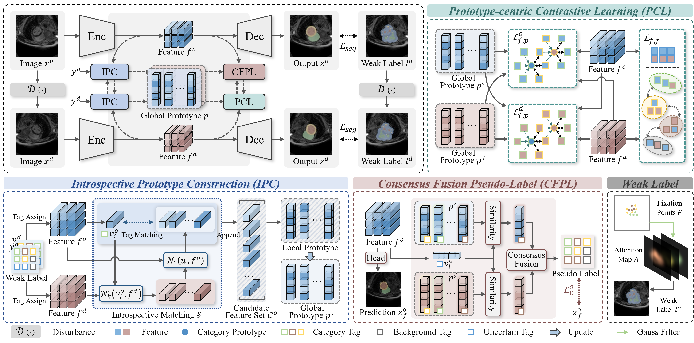

# InPro: Introspective Prototype-guided Framework with Consensus Pseudo-Label for Gaze-supervised Medical Image Segmentation
> Creating fully annotated labels for medical image segmentation remains both time-consuming and expensive, underscoring the necessity for innovative strategies that reduce dependence on dense annotations. 
Eye-tracking provides a cost-effective source of supervision that can be seamlessly integrated into radiologists’ workflows without imposing additional annotation burdens. Nevertheless, in multi-class segmentation settings, the inherent sparsity and ambiguity of gaze substantially degrade the quality of supervision, resulting in class diffusion and inaccurate segmentation in spatially adjacent regions.
To overcome these limitations, we propose the Introspective Prototype-guided framework (InPro) for gaze-supervised medical image segmentation. 
Specifically, the introspective prototype construction module is first developed to eliminate unstable features and construct reliable prototypes by exploiting similarity queries across inter-view features combined with an introspective matching strategy.
To further mitigate ambiguity in gaze, the prototype consensus pseudo-label module infers labels in uncertain regions through a multi-prototype consensus mechanism, thereby enhancing supervisory signals. 
Finally, the prototype-centered contrastive learning module is employed to maximize inter-class feature separability, strengthen discrimination between neighboring anatomical structures, and improve segmentation performance.
Experimental results on two public datasets demonstrate that InPro outperforms state-of-the-art methods for gaze-supervised medical image segmentation. 

# Model Weights
The download links and extraction codes for our model weights are as follows：[Checkpoint](https://pan.baidu.com/s/1cRE9u6sSXicBgcr9r1AgjA?pwd=7777)

# Datasets
1. The MSCMR dataset with mask annotations can be downloaded from [MSCMRseg](https://zmiclab.github.io/zxh/0/mscmrseg19/data.html).
2. The ACDC dataset with mask annotations can be downloaded from [ACDC](https://www.creatis.insa-lyon.fr/Challenge/acdc/).

## Qualitative Results

## Requirements
* python 3.8  
* torch 1.12.0 
* numpy 1.24.4 
* medpy 0.5.1 
* nibabel 5.2.1 
* pandas 2.0.3 
* scikit-image 0.21.0 

## Acknowledgement
This repo partially uses code from [CycleMix](https://github.com/BWGZK/CycleMIx).
